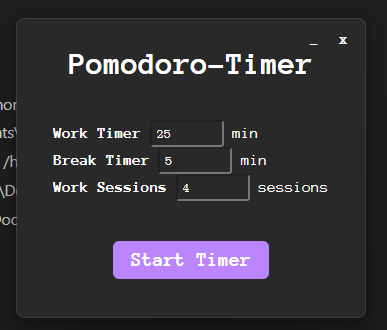
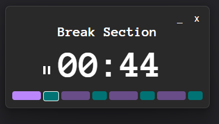
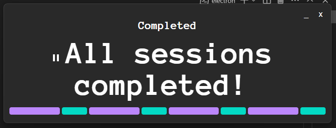

# Pomodoro Timer

Very simple pomodoro timer created using electron. 

## Features
- custom time range for work sections
- custom time range for break sections
- counter how many repeats of the "work-break" combination you wanna do
- pause option for the timer
- progress bar showing completed, active and remaining sections